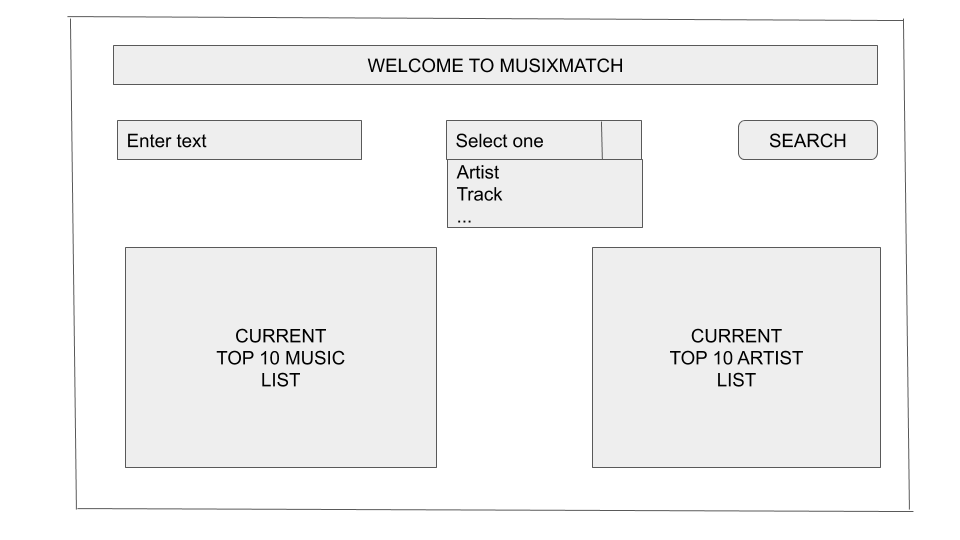

# Project 3. **🎤 Musix 🎶 Match 🎧** The Music Search Application

## 1. Technologies used

* HTML, CSS, JavaScript, Google Chrome
* Materialize framework for styling (based on Google Material Design)
* AJAX and AXIOS for API Access
* Postman Application for API Testing (accessing data available on musixmatch.com) 
* Heroku cloud application platform for deployment
* React JavaScript library was used for the front end development
* Deployed at https://**<== Project ==>**.herokuapp.com/

## 2. Development Team

* Jonathan Acheampong (Lead)
* David Lane
* Mohan Palat

## 3. Technical Requirements

### 3.1 Problem to be resolved: 

Many music lovers were looking for an application which allows them wild card search allowing them to look up details about their favorite artists, tracks, albums and lyrics. 

### 3.2 Solution and who would use it

It will be used by the many music lovers craving for information. The data is available on musixmatch.com. We needed to provide the search and resultson the web formatted in a way to make it a pleasent experience.

#### 3.2.1 UI Soutioning
Used HTML, CSS, JavaScript, Google Chrome and Materialize Framework for styling 

#### 3.2.2 API Soutioning
Provider of choice was musixmatch.com. 
The following list of operations were used from list of calls provided. 
<table>
<thead>
<tr>
<th>Component #</th>
<th>Component</th>
<th>API Call</th>
<th>Purpose</th>
</tr>
</thead>
<tbody>
<tr>
<td>1</td>
<td>Artist</td>
<td>GET /artist.search</td>
<td>List details of artist user is searching for as a wild card </td>
</tr>
<tr>
<td>2</td>
<td>Track</td>
<td>GET /track.search</td>
<td>List details of a track user is searching for as a wild card </td>
</tr>
<tr>
<td>3</td>
<td>Album</td>
<td>GET /track.search</td>
<td>List details of an album user is searching for as a wild card </td>
</tr>
<tr>
<td>4</td>
<td>Lyric</td>
<td>GET /lyric.search</td>
<td>List details of lyric user is searching for as a wild card </td>
</tr>
</tbody>
</table>

#### 3.2.3 Solutioning Cloud Deployment to AWS
Heroku Cloud Application Platform for Deploment

## 4. Learning Experience

* <== Experience **with API workaround** ==>
* <== Experience **with Materialize** ==>
* <== Experience ==>

## 5. Approach & Design Components - Wireframe, API

### 5.1 Wireframes

#### 5.1.1 Wireframe - Main Page
 
#### 5.1.1 Wireframe - Details Page
 
### 5.2 API Details

**<== Joathan ==>**

## 6. User Stories and their implementation status

1. As a user, I should be able to search for list of artists by name
2. As a user, I should be able to select one of artist from list
3. Once an artist is selected, I should be able to see artist details 
4. As a user, I should be able to search for list of track by name
5. As a user, I should be able to select one track from list
6. As a user, I should be able to select one of artist from track
7. As a user, I should be able to search for lyrics by embedded keyword
8. As a user, I should be able to be flagged above the lyrics if it has explicit content
9. As a user, I should be able to search for list of albums by name
10. As a user, I should be able to select one of albums from list
11. Once an album is selected, I should be able to see album details 

## 7. Compliance to MVP (Minimum Viable Product) Requirement 🔴 

### 7.1 Base Requirement

* A GitHub repo with your React app **Status: Complete**
* You must use React and leverage the API in the above requirements. **Status: Complete**
* You must communicate with the API and render the UI accordingly with the information received (using axios). **Status: Complete**
* Review the Rubric for the specifics of how your project will be graded. **Status: <=== TBD ===>**

### 7.2 Collaboration
* Every team member must have roughly the same number of individual commits in the commit history for your app (dividing responsibilities between different parts of the app is fine, but every team member must have commits in the project). **The team worked very well by dividing and synchronizing the available work as chunks**
* Every team must follow a Git Workflow **leveraging the GIT branches - main, track, artist, album and lyric and finally merging them effiiciently** 

### 7.3 Deployment
Your React app must be deployed to Heroku, GitHub Pages, or Surge. Applications that are not deployed will be considered incomplete. **Our application was deployed to production using Heroku**

## 8. Unsolved Issues and Future Enhancements

**<=== ? ===>**

Maybe Albums
Third Party API to render images of the artists

