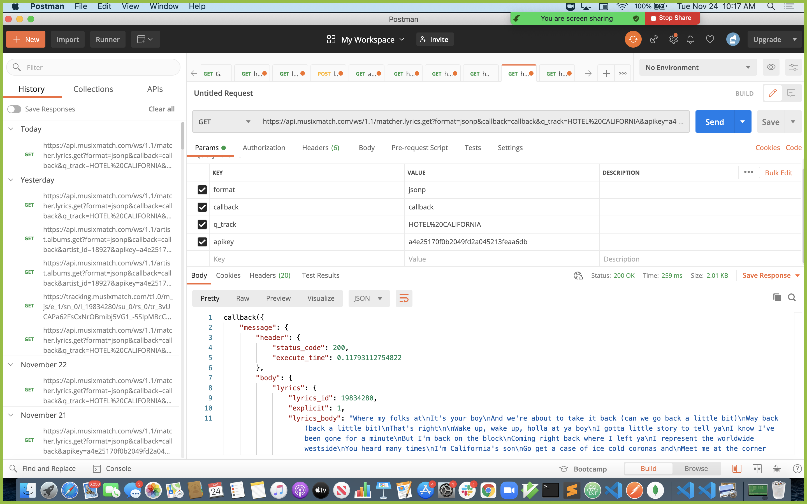
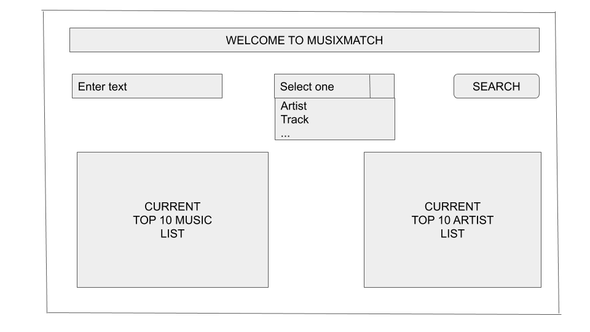
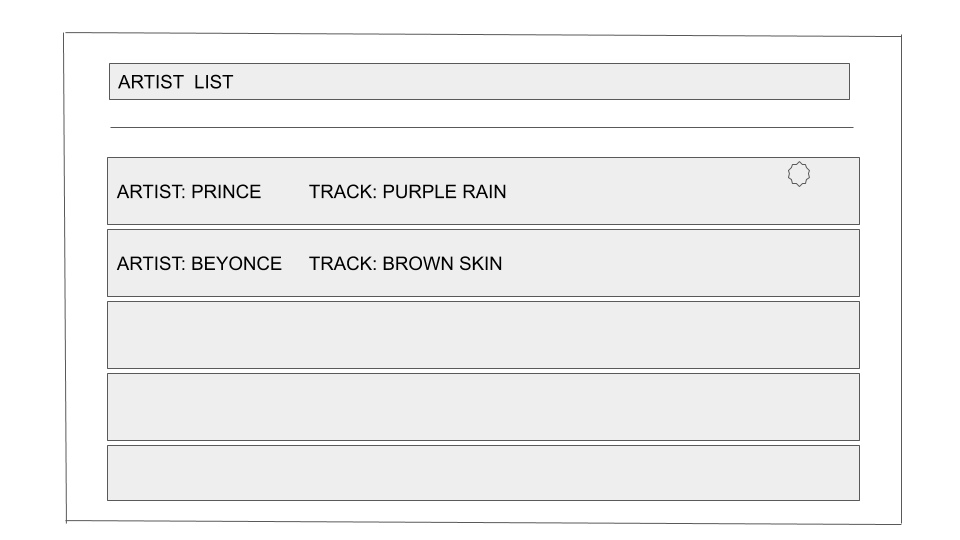

# Planning

## 1. Project Idea

### 1.1. Highlights

- Based on Project Requirements, Common Interest, and Instructor
  Recommendations.
- Fast-Access to Music: Top Ten, Artist, Track(song), and Lyrics.

- Easy to use with dropdown selection with Search box.

- Dynamic Results based on the user’s specified search.

### 1.2. Planning Summary

The development team agreed on a Music app that provides fast access to details on their favorite music. The app would provide detailed music information: track, lyrics, album, and artist categories.

A wireframe showing a dropdown box, text search input field, and space to render results was created. The team tested multiple APIs to confirm feasibility. The work was divided between teammates based on User Stories.

## 2. API

The API was chosen based on project requirements and researching the best APIs to render search requests.
Click here to visit Musixmatch webpage [API.](https://developer.musixmatch.com/)

### 2.1. Confirmation for API

Testing to confirm GET requests was done using Postman and the browser console:

## 3. Wireframing

#### 3.1. Wireframe - Main Page

#### 3.2. Wireframe - Details Page

## 4. User Stories

1. As a user, I should be able to search for list of artists by name
2. As a user, I should be able to select one of artist from list
3. Once an artist is selected, I should be able to see artist details
4. As a user, I should be able to search for list of track by name
5. As a user, I should be able to select one track from list
6. As a user, I should be able to select one of artist from track
7. As a user, I should be able to search for lyrics by embedded keyword
8. As a user, I should be able to be flagged above the lyrics if it has explicit content
9. As a user, I should be able to see the top 10 songs on the chart in the homepage
10. As a user, I should be able to search for albums

## 5. Individual Team Member Responsibilities

- **Jonathan Acheampong** - App Component, Project Planning, CSS, GIT

- **David Lane** - Tracks/Album Component, Planning Doc

- **Mohan Palat** - Artist/Lyrics Component, README Doc
